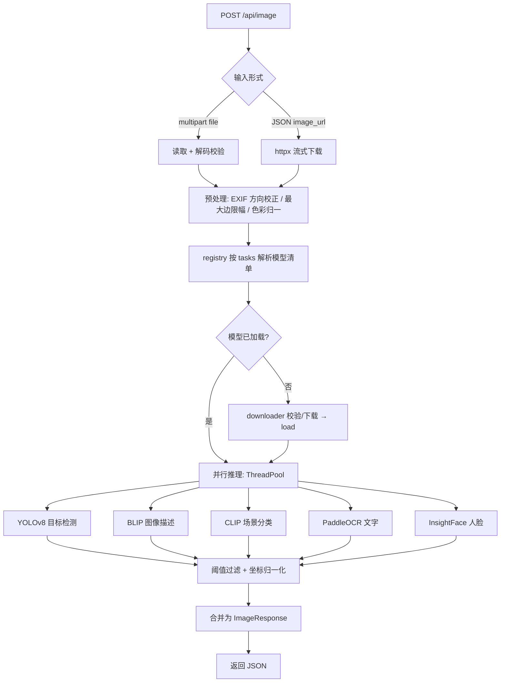
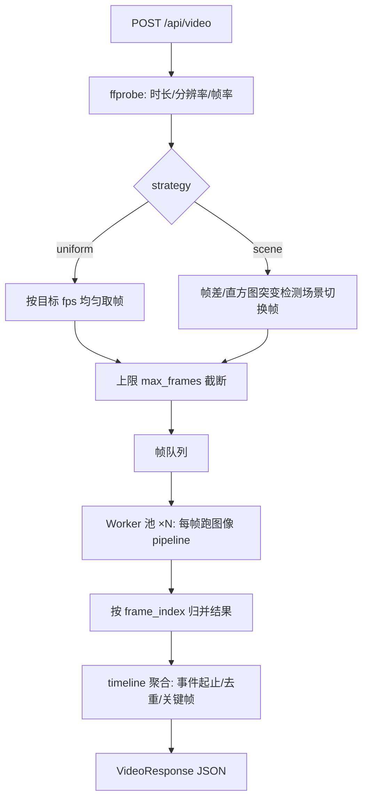

# dsh-vision 技术设计方案（Phase 1）

> 工作名暂定 **`dsh-vision`**（仓库名可改）。定位：**独立运行的视觉识别 HTTP 服务 + Python SDK**，不依赖任何 DeepSeek 内部服务；DeepSeek 及任意 LLM agent 通过 function calling 以 HTTP 调用。本文件为技术设计稿，对应 Phase 1 交付，Phase 2 将以此为构建基准。

---

## 1. 项目结构（目录树）

```
dsh-vision/
├── app/
│   ├── __init__.py
│   ├── main.py                      # FastAPI 入口：路由挂载、生命周期（模型懒加载/缓存目录初始化）
│   ├── config.py                    # pydantic-settings 读取 config.yaml（设备、阈值、抽帧参数）
│   ├── api/
│   │   ├── __init__.py
│   │   ├── routes_health.py         # GET /health、GET /models
│   │   ├── routes_image.py          # POST /api/image
│   │   ├── routes_video.py          # POST /api/video（+ 可选异步任务模式）
│   │   └── schemas.py               # 全部请求/响应 Pydantic 模型（OpenAPI 自动生成）
│   ├── core/
│   │   ├── __init__.py
│   │   ├── registry.py              # 模型注册表：名称→工厂函数、启用开关、设备分配
│   │   ├── cache.py                 # 模型缓存目录（默认 ~/.cache/dsh-vision，可用环境变量覆盖）
│   │   ├── downloader.py            # 模型下载：断点续传 + SHA256 校验 + 清单驱动
│   │   └── errors.py                # 统一业务异常 → HTTP 错误映射
│   ├── vision/
│   │   ├── __init__.py
│   │   ├── base.py                  # BaseVisionModel 抽象接口（load/predict/close）
│   │   ├── object_detection.py      # 目标检测：YOLOv8（ultralytics / ONNX 双后端可切换）
│   │   ├── captioning.py            # 图像描述：BLIP
│   │   ├── scene.py                 # 场景分类：CLIP 零样本
│   │   ├── ocr.py                   # 文字识别：PaddleOCR（可切换 EasyOCR）
│   │   ├── faces.py                 # 人脸：InsightFace（检测+特征）
│   │   └── pipeline.py              # 单图多任务编排（并行执行、结果合并）
│   ├── video/
│   │   ├── __init__.py
│   │   ├── probe.py                 # ffprobe：时长/分辨率/帧率/编码
│   │   ├── extractor.py             # 抽帧：目标 fps 均匀采样 / 场景切换帧
│   │   ├── worker.py                # 并行处理池（线程池，每线程独立模型实例）
│   │   └── timeline.py              # 时间线聚合：去重、事件起止时间、关键帧选取
│   └── sdk/
│       ├── __init__.py
│       └── client.py                # VisionClient（httpx 封装，供外部 Python 调用）
├── scripts/
│   ├── download_models.py           # 一键下载全部/指定模型
│   └── generate_openapi.py          # 导出 OpenAPI JSON（供 function calling 注册）
├── tests/
│   ├── conftest.py                  # 测试夹具：mock 模型、临时缓存、TestClient
│   ├── test_vision_modules.py       # 各识别模块单测（mock 权重）
│   ├── test_api_image.py            # /api/image 端到端
│   ├── test_api_video.py            # /api/video 端到端
│   ├── test_extractor.py            # 抽帧策略单测
│   ├── test_timeline.py             # 时间线聚合单测
│   └── test_sdk.py                  # SDK 客户端单测
├── examples/
│   ├── image_example.py             # SDK 图像识别示例
│   └── video_example.py             # SDK 视频识别示例
├── docker/
│   ├── Dockerfile                   # 多阶段构建（CPU 版）
│   ├── Dockerfile.gpu               # GPU 版（CUDA base）
│   └── compose.yaml
├── .github/workflows/
│   ├── ci.yml                       # 单元测试（pytest + coverage + ruff）
│   └── docker-build.yml             # 构建并推送 Docker 镜像
├── requirements.txt
├── requirements-dev.txt
├── requirements-cpu.txt / requirements-gpu.txt   # torch/paddle 平台分支
├── config.yaml                      # 运行配置
├── models.json                      # 模型清单：源 URL、SHA256、许可、默认开关
├── .gitignore
├── LICENSE                          # MIT
└── README.md
```

---

## 2. 模块职责拆分

| 模块 | 职责 | 关键点 |
|---|---|---|
| `app/main.py` | 应用入口、路由注册、启动时初始化缓存目录与模型注册表 | 模型**懒加载**（首次调用才下载/载入），启动秒级 |
| `app/config.py` | 配置模型（yaml → pydantic） | 设备 `auto/cuda/cpu`、置信度阈值、OCR 语言、抽帧 fps/上限 |
| `app/core/registry.py` | 模型注册中心 | 名称→工厂；`get_model(name)` 返回单例；未启用模型返回 400 |
| `app/core/downloader.py` | 模型下载 | 读 `models.json`；断点续传；SHA256 校验；失败不污染缓存 |
| `app/vision/base.py` | 模型抽象接口 | `load() / predict(input) / close()`；所有实现继承，便于替换 |
| `app/vision/*.py` | 各识别算法封装 | 输入统一为 numpy BGR 数组；输出统一为纯 JSON 结构 |
| `app/vision/pipeline.py` | 单图编排 | 按 `tasks` 参数并行跑选中的模型（线程池），合并结果 |
| `app/video/*.py` | 视频链路 | 抽帧→并行识别→时间线聚合 |
| `app/sdk/client.py` | Python SDK | `VisionClient(base_url)`：`recognize_image() / recognize_video()` |
| `scripts/download_models.py` | 预下载 | `python scripts/download_models.py --models object,ocr` |

---

## 3. API 设计

### 3.1 端点一览

| 方法 | 路径 | 说明 |
|---|---|---|
| GET | `/health` | 存活检查（返回版本、设备、已加载模型） |
| GET | `/models` | 列出可用模型及其许可、启用状态 |
| POST | `/api/image` | 图像识别（文件上传 **或** image_url） |
| POST | `/api/video` | 视频识别（文件上传 **或** video_url） |
| GET | `/openapi.json` | FastAPI 自动生成（function calling 注册依据） |

### 3.2 图像识别 `POST /api/image`

**请求**：`multipart/form-data`（上传 `file`）或 `application/json`（`{"image_url": "..."}`），公共字段放表单/query：

```jsonc
{
  "image_url": "https://example.com/a.jpg",   // 与 file 二选一
  "tasks": ["objects", "caption", "scene", "ocr", "faces"],  // 缺省=全部启用项
  "min_confidence": 0.35,                      // 全局置信度阈值（默认取 config）
  "ocr_langs": ["ch", "en"]                    // 可选，覆盖 OCR 语言
}
```

**响应** `200`：

```jsonc
{
  "request_id": "img_8f3a...",
  "width": 1920, "height": 1080,
  "objects": [{"label": "person", "confidence": 0.93, "bbox": [120, 80, 640, 1080]}],
  "caption": "a group of people walking on a city street",
  "scene": {"label": "urban_outdoor", "confidence": 0.87},
  "text": [{"text": "COFFEE", "confidence": 0.96, "bbox": [10, 20, 300, 80], "lang": "en"}],
  "faces": [{"bbox": [100, 100, 200, 280], "confidence": 0.99,
             "landmarks": [[...]], "embedding_md5": "ab12..."}],
  "models_used": {"objects": "yolov8n", "caption": "blip-base", "ocr": "ppocrv4", "faces": "buffalo_l"},
  "processing_time_ms": 842
}
```

> 人脸仅返回特征摘要（`embedding_md5`）而非原始向量，避免把高敏生物特征直接塞进对话上下文；如需比对提供 `/api/face/verify` 扩展点（设计预留，不在 MVP）。

### 3.3 视频识别 `POST /api/video`

**请求**：multipart 上传 `file` 或 JSON `{"video_url": ...}`，附加参数：

```jsonc
{
  "fps": 1.0,            // 目标采样帧率（缺省 1，范围 0.1–10）
  "max_frames": 120,     // 抽帧上限（防御长视频）
  "strategy": "uniform", // uniform=均匀采样 | scene=场景切换帧
  "tasks": ["objects", "ocr", "faces"],
  "include_keyframes": false  // true 时关键帧以 base64 返回
}
```

**响应**：

```jsonc
{
  "request_id": "vid_2c91...",
  "duration_sec": 182.4, "sampled_frames": 96,
  "results": [
    {"frame_index": 0, "timestamp_sec": 0.0,
     "objects": [{"label": "car", "confidence": 0.91, "bbox": [...]}],
     "text": [...], "faces": [...]}
  ],
  "timeline": [   // 聚合后的"事件"：同一目标连续出现的时间段
    {"event": "car", "start_sec": 0.0, "end_sec": 12.5, "max_confidence": 0.95}
  ],
  "processing_time_ms": 15023
}
```

### 3.4 错误约定

| HTTP | 场景 |
|---|---|
| 400 | 图片/视频无法解码、URL 下载失败、任务名未知 |
| 404 | 请求的模型未启用/未安装 |
| 422 | 参数校验失败（FastAPI 标准） |
| 503 | 模型正在下载/加载中（配合 `Retry-After`） |
| 500 | 推理内部错误（含 `error` 消息与 `request_id`，便于日志关联） |

### 3.5 异步任务模式（设计预留，非 MVP）

视频识别可能耗时较长（分钟级）：
- `POST /api/video/jobs` → `202 {job_id}`
- `GET /api/video/jobs/{job_id}` → `{status: queued|running|done|failed, progress, result}`
- MVP 先做同步版；异步版作为 Phase 3 之后的可选增强，设计上把 `worker.py + timeline.py` 解耦，迁移成本低。

---

## 4. 依赖清单（requirements.txt 规划）

**运行时**：

```
fastapi>=0.115,<1.0
uvicorn[standard]>=0.30
pydantic>=2.7
pydantic-settings>=2.3
python-multipart>=0.0.9
httpx>=0.27            # URL 下载 + SDK 客户端
numpy>=1.26,<2.0
opencv-python-headless>=4.9
pillow>=10.3
pyyaml>=6.0
torch>=2.2             # 平台分支见下
transformers>=4.40
ultralytics>=8.2       # ⚠️ AGPL-3.0，见许可章节
paddleocr>=2.7         # 或 easyocr>=1.7（可切换）
paddlepaddle>=2.6      # 平台分支见下
insightface>=0.7.3
onnxruntime>=1.17      # 可选：检测/人脸走 ONNX 加速
ffmpeg-python>=0.2.0   # 依赖系统 ffmpeg
```

**平台分支**（体积优化，安装指南中二选一）：
- `requirements-cpu.txt`：`torch` CPU wheel + `paddlepaddle` CPU（`--index-url https://download.pytorch.org/whl/cpu`）
- `requirements-gpu.txt`：`torch` CUDA wheel + `paddlepaddle-gpu`
- OCR 设计为**可选依赖**：`pip install dsh-vision[ocr-paddle]` / `[ocr-easy]`，不带 OCR 也能跑其余任务

**开发/测试**：`pytest>=8`、`pytest-asyncio>=0.23`、`ruff>=0.4`、`coverage>=7`、`httpx`（TestClient 复用）。

---

## 5. 识别流程图

### 5.1 图像识别



### 5.2 视频识别



---

## 6. 模型选型与理由

| 功能 | 首选模型 | 加载方式 | 理由 | 许可 ⚠️ |
|---|---|---|---|---|
| 目标检测 | **YOLOv8n/s**（COCO-80） | ultralytics，可切 ONNX | 精度/速度均衡、生态成熟、易导出 ONNX/量化 | **AGPL-3.0**（见下方说明） |
| 图像描述 | **BLIP-base**（Salesforce） | transformers | 描述自然度好、单模型轻量 | BSD-3-Clause*（权重需核验） |
| 场景分类 | **CLIP ViT-B/32** 零样本 | transformers | 免训练即可识别室内/室外/城市/自然等；与检测互补 | MIT |
| OCR | **PaddleOCR PP-OCRv4** | paddleocr | 中英多语言精度第一梯队 | Apache-2.0 |
| 人脸 | **InsightFace buffalo_l** | insightface（onnx） | 检测+512 维特征一体；可扩展比对/验证 | MIT*（权重需核验） |

**后备/可替换项**：EasyOCR（Apache-2.0，轻量但慢）、torchvision Faster R-CNN/RetinaNet（BSD-3-Clause，许可更干净但精度/速度不如 YOLOv8）。

### ⚠️ 许可策略（重要决策点）

- **ultralytics/YOLOv8 是 AGPL-3.0**：作为依赖使用不影响本项目 MIT 分发（AGPL 传染的是"修改/再分发 ultralytics 本身"），但 README 必须**显著声明**，且 `models.json` 许可表要逐项列出。
- **追求"全 MIT 干净"的替代方案**：检测器换成 torchvision Faster R-CNN（BSD-3）或 OpenMMLab RTMDet（Apache-2.0）。实现上通过 `BaseVisionModel` 抽象，**检测器实现可无痛替换**，两种路线都支持。
- 建议：**默认 YOLOv8 + 完整许可声明**（功能优先，社区惯例），并在 README 提供"纯净许可模式"说明。待用户拍板后按选定路线实现。

---

## 7. 视频抽帧策略

| 维度 | 设计 |
|---|---|
| 采样方式 | 默认 **uniform**（按目标 fps 均匀取帧，默认 1 fps）；可选 **scene**（帧间 HSV 直方图卡方距离超过阈值即视为切换帧，减少冗余） |
| 上限 | `max_frames` 默认 120；超过则均匀丢弃（保首尾帧） |
| 抽帧实现 | 优先 **ffmpeg**（`select`/`fps` filter，精确 seek、解码鲁棒），退化用 OpenCV `VideoCapture` |
| 并行 | `ThreadPoolExecutor(max_workers=min(4, cpu))`；**每 worker 一个独立模型实例**（torch 推理释放 GIL，线程池够用；避免进程池重复加载模型的显存/内存开销） |
| 时间戳 | `timestamp_sec = frame_index / source_fps`（用 ffprobe 的真实 fps，不用目标 fps，保证与视频时间轴一致） |
| 聚合 | `timeline.py`：同一 label 连续 N 帧出现 → 合并为事件 `{start_sec, end_sec, max_confidence}`；仅出现 1 帧的噪声丢弃（可配 `min_frames`）；关键帧取事件内置信度最高的帧 |
| 负载控制 | `max_frames` + 可选 `max_duration_sec`；大视频提示用户用异步任务模式 |

---

## 8. 部署方案

**本地运行**：
```bash
git clone <repo> && cd dsh-vision
python -m venv .venv && source .venv/bin/activate   # Windows: .venv\Scripts\activate
pip install -r requirements-cpu.txt
python scripts/download_models.py                    # 可选：预下载（否则首调用自动下载）
uvicorn app.main:app --host 0.0.0.0 --port 8000
```

**Docker**（多阶段构建，非 root 用户）：
```dockerfile
# builder: pip 装依赖
# runtime: python:3.11-slim + ffmpeg + 模型缓存卷 /models（或 ~/.cache）
# HEALTHCHECK: curl /health
# 以非 root 运行；GPU 版换 nvidia/cuda base 并保留 pip 层
```
```bash
docker build -f docker/Dockerfile -t dsh-vision:0.1.0 .
docker run -p 8000:8000 -v dsh-vision-models:/root/.cache/dsh-vision dsh-vision:0.1.0
# GPU: docker run --gpus all ...
```

**外部依赖**：系统需 `ffmpeg`（Docker 内已装）；无其他外部服务依赖——**完全独立运行**。

---

## 9. DeepSeek function calling 集成

1. **OpenAPI 自动生成**：FastAPI 自动产出 `/openapi.json`；`scripts/generate_openapi.py` 可导出为静态文件，供注册时直接引用。
2. **工具注册示例**（DeepSeek 侧 function calling 的 JSON Schema，与 `/api/image` 参数一一对应）：

```jsonc
{
  "type": "function",
  "function": {
    "name": "vision_recognize_image",
    "description": "识别图片内容：目标、场景、文字、人脸、图像描述。输入图片 URL。",
    "parameters": {
      "type": "object",
      "properties": {
        "image_url": { "type": "string", "description": "图片的公开 HTTP(S) URL" },
        "tasks": {
          "type": "array", "items": { "type": "string", "enum": ["objects","caption","scene","ocr","faces"] },
          "description": "要执行的任务，缺省为全部"
        },
        "min_confidence": { "type": "number", "minimum": 0, "maximum": 1 }
      },
      "required": ["image_url"]
    }
  }
}
```

3. **调用链**：`DeepSeek → function calling(HTTP POST http://<dsh-vision>:8000/api/image) → JSON 回填给模型`。服务方只负责识别，不参与模型推理链路，**零耦合**。
4. **URL 可达性**：DeepSeek 环境需能访问该服务的地址；README 中给出局域网/内网部署示例（`--host 0.0.0.0` + 防火墙说明）。
5. 若未来接入 DSH harness，可再写一个薄薄的 dsh 工具插件包装该 HTTP 服务（`ctx.tools.register`）——但本项目本身不依赖 DSH，独立可发布。

---

## 10. 待确认决策点

1. **检测器许可路线**：YOLOv8（功能优先，AGPL 声明）还是全 BSD 干净路线（torchvision Faster R-CNN）？→ 建议 YOLOv8
2. **OCR 引擎**：PaddleOCR（精度高、重）还是 EasyOCR（轻、慢）？→ 建议 PaddleOCR 主选 + EasyOCR 可切换
3. **图像描述语言**：BLIP 英文描述（开箱即用）还是中文方案（需额外模型/翻译，体积与延迟上升）？→ 建议 MVP 英文，中文列为后续
4. **视频模式**：MVP 只做同步，还是同步+异步任务一起？→ 建议 MVP 同步，异步后置
5. **运行目标**：CPU 为主还是需要 GPU 支持？→ 影响 requirements 分支与 Docker 变体
6. **项目命名**：`dsh-vision` 是否 OK？（避免与已存在的 `dsh-vision-plugin` 撞名）
